# 🏎️ DRAGSTER — Maker Option Project

**A fully custom brushless electric dragster built from scratch: custom PCB, STM32 firmware, 3D-printed chassis and Bluetooth telemetry.**


---

## 📋 Table of Contents

- [Project Overview](#project-overview)
- [System Architecture](#system-architecture)
- [Project Structure](#project-structure)
- [Electronic Design](#electronic-design)
- [Software](#software)
- [3D Modelling and Mechanical Aspect](#3d-modelling-and-mechanical-aspect)
- [Known Issues](#known-issues)

---

## 🚀 Project Overview

This project was carried out as part of the **Maker Option** at school. The goal was to design and build a functional brushless electric dragster entirely from scratch, covering every aspect of the engineering process:

- Custom **4-layer PCB** designed in KiCad
- **STM32G431CBU6** microcontroller firmware written in C with STM32CubeIDE
- **Bluetooth** remote control and telemetry via HC-05
- **3D-printed** chassis and mechanical parts designed in Onshape
- **Brushless motor** driven by a commercial ESC via PWM

---

## 🏗️ System Architecture

### 💡 System Block Diagram

The dragster architecture follows a centralized embedded system design with the STM32G431CBU6 microcontroller managing all peripherals, sensor data acquisition, motor control, and wireless communications.

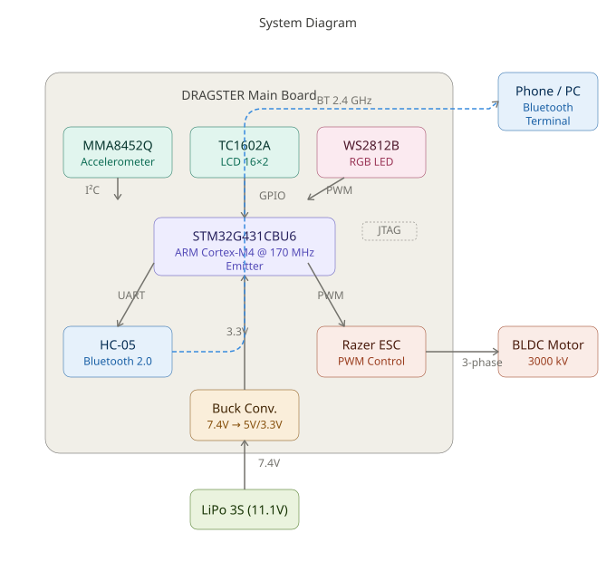

**Key Subsystems:**
- **Flight Computer**: STM32G431CBU6 (ARM Cortex-M4 @ 170 MHz)
- **Sensor Suite**: MMA8452Q 3-axis accelerometer (I²C interface)
- **Human Interface**: TC1602A 16×2 LCD display + WS2812B RGB LED
- **Communications**: HC-05 Bluetooth 2.0 module (UART interface)
- **Motor Control**: Robitronic Razer Ten ESC driving 3000kV BLDC motor
- **Power**: LiPo 3S (11.1V) with buck regulation to 5V/3.3V

### 🔌 Electrical Schematic Overview

The electrical design emphasizes clean power distribution and proper signal isolation between high-current motor traces and sensitive analog sensors.

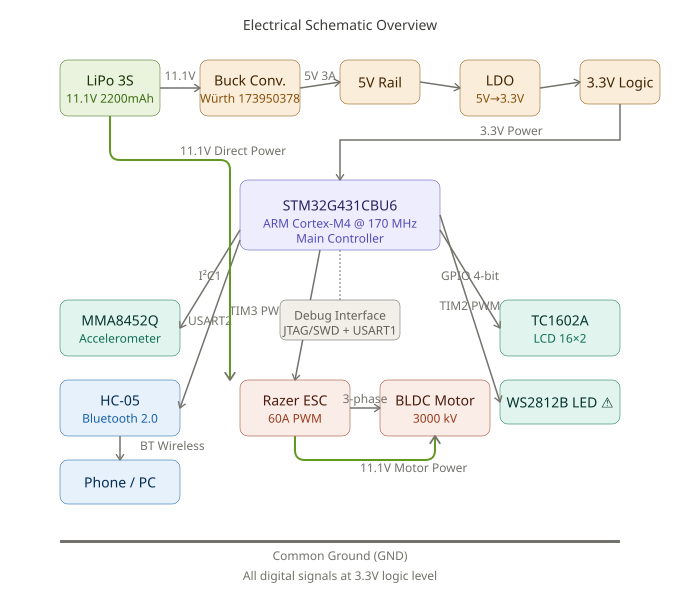

**Power Distribution:**
- **11.1V LiPo Battery** → Buck Converter (Würth 173950378) → **5V Rail**
- **5V Rail** → Linear regulators → **3.3V Logic**
- Separate power planes for motor and logic to minimize EMI

**Signal Integrity:**
- I²C bus: 4.7kΩ pull-ups, 400 kHz operation
- UART: 3.3V logic levels, 9600 baud
- PWM: 50 Hz for ESC, 800 kHz for WS2812B
- SWD debug: dedicated JTAG connector

### 🔩 Mechanical Assembly Overview

The mechanical design prioritizes low center of gravity, rear-wheel drive power transfer, and straight-line stability.

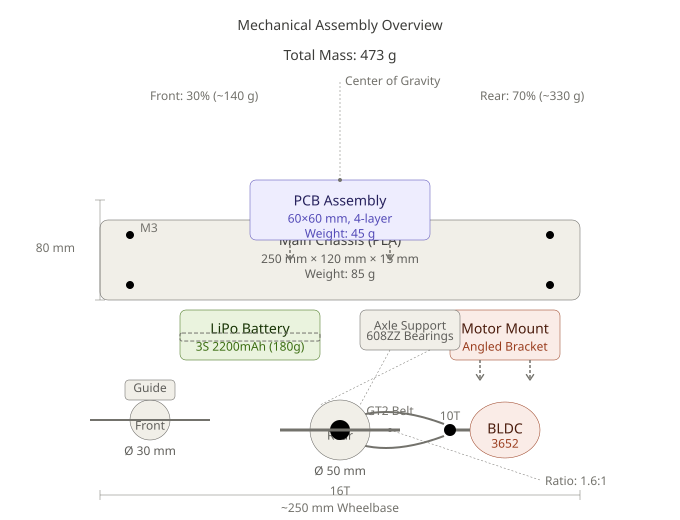

**Component Mounting:**
- **Main Chassis**: Flat PLA plate (base structure)
- **Motor Mount**: Rear bracket aligned with drive pulley
- **PCB Mounting**: Center position for balanced weight distribution
- **Wheel Configuration**: Larger rear wheels for traction, smaller front for steering

---

## 📁 Project Structure

```
DRAGSTER/
│
├── 📖 README.md                        # This file
│
├── 🖼️ IMG/                             # Photos of the physical build
│   ├── dragster_assembled.jpg          # Final assembled dragster
│   ├── system_diagram.svg              # System block diagram
│   ├── electrical_schematic.svg        # Electrical schematic
│   ├── mechanical_assembly.svg         # Mechanical assembly diagram
│   ├── pcb_3d_top.png                  # KiCad 3D render top
│   ├── pcb_3d_bottom.png               # KiCad 3D render bottom
│   ├── pcb_real_top.jpg                # Real PCB top view
│   ├── pcb_real_bottom.jpg             # Real PCB bottom view
│   ├── corps_3d.png                    # Dragster body 3D render
│   ├── support_moteur_3d.png           # Motor mount 3D render
│   ├── support_roues_3d.png            # Wheel axle support 3D render
│   └── guide_roues_3d.png             # Lateral wheel guide 3D render
│
├── 📐 CAO/                             # CAD files and design resources
│   ├── DRAGSTER_Cube_MX/               # STM32CubeMX pin configuration project
│   │   └── DRAGSTER_Cube_MX.ioc        # CubeMX IOC file (pin mapping)
│   ├── DRAGSTER_PCB/                   # KiCad PCB project
│   │   ├── DRAGSTER.kicad_pcb          # PCB layout
│   │   ├── DRAGSTER.kicad_sch          # Schematic
│   │   └── ...
│   └── DRAGSTER_3D/                    # Onshape STL exports
│       ├── Corps.stl                   # Dragster body
│       ├── Support_Moteur.stl          # Motor mount
│       ├── Support_roues.stl           # Camshaft / wheel axle support
│       └── Guide_roues.stl             # Lateral wheel guide
│
└── 💻 DRAGSTER_FIRMWARE/               # STM32CubeIDE project
    └── DRAGSTER/
        ├── Core/
        │   ├── Src/
        │   │   ├── main.c              # Application entry point
        │   │   ├── bldc_esc.c          # ESC / brushless motor driver
        │   │   ├── hc05_bt.c           # Bluetooth driver + command parser
        │   │   ├── mma8452q.c          # Accelerometer driver
        │   │   ├── tc1602a_lcd.c       # LCD driver
        │   │   └── ws2812.c            # NeoPixel LED driver
        │   └── Inc/
        │       ├── bldc_esc.h
        │       ├── hc05_bt.h
        │       ├── mma8452q.h
        │       ├── tc1602a_lcd.h
        │       └── ws2812.h
        └── ...
```

---

## ⚡ Electronic Design

### 🔗 Component Selection & Justification

| Component | Model | Specifications | Engineering Rationale |
|-----------|-------|----------------|----------------------|
| **Microcontroller** | STM32G431CBU6 | ARM Cortex-M4, 170 MHz, UFQFPN48, 128 KB Flash, 32 KB RAM, Hardware FPU | High processing speed for real-time sensor fusion and PWM generation; hardware floating-point unit accelerates velocity integration algorithms; 170 MHz provides sufficient headroom for Bluetooth protocol handling |
| **Brushless Motor** | Robitronic Razer Ten 3652 3000kV (R01230) | 3000 kV, 3652 form factor, 3S LiPo compatible, 350W max power | High kV rating provides aggressive acceleration; 3S compatibility matches battery voltage; compact 3652 size fits dragster chassis constraints |
| **ESC** | Robitronic Razer Ten ESC | PWM control 50 Hz, pulse 1–2 ms, waterproof, 60A continuous | Standard RC PWM interface simplifies firmware; 60A rating provides safety margin for peak current draws; waterproof design protects against track debris |
| **Accelerometer** | MMA8452Q | 3-axis, 12-bit resolution, I²C interface, ±8g range, 800 Hz ODR, embedded FIFO | ±8g range captures full dragster launch dynamics; 800 Hz sampling rate prevents aliasing of high-frequency vibrations; I²C interface reduces pin count; FIFO buffer offloads MCU during burst acceleration |
| **LCD Display** | TC1602A | 16×2 characters, HD44780 controller, 4-bit parallel interface, 5V tolerant | Industry-standard HD44780 ensures driver compatibility; 4-bit mode saves GPIO pins; 16×2 layout accommodates speed/peak display; high contrast for outdoor visibility |
| **Bluetooth Module** | HC-05 | Bluetooth 2.0 Classic SPP, UART interface, 9600 baud default, 3.3V logic, 10m range | Serial Port Profile (SPP) enables simple UART passthrough; 9600 baud sufficient for telemetry bandwidth; 3.3V logic compatible with STM32 GPIO; widely supported by PC/Android terminals |
| **RGB LED** | WS2812B | Addressable RGB, 800 kHz PWM protocol, 5V supply, single-wire control | Addressable interface allows dynamic status indication; single-wire protocol minimizes pin usage; built-in PWM drivers offload MCU; **Note**: 5V requirement conflicts with 3.3V board supply |
| **Battery** | LiPo 3S | 11.1V nominal (12.6V max, 9V min), 2200 mAh capacity, 25C discharge | 3S voltage matches motor/ESC specifications; 2200 mAh provides ~5 min runtime at full throttle; 25C discharge rating (55A burst) exceeds motor peak current |
| **Buck Converter** | Würth 173950378 (replaces LMR51625) | Input: 7–36V, Output: 5V @ 3A, Switching: 2.1 MHz, Efficiency: 90% | Wide input range handles battery sag; 5V @ 3A powers LCD + logic; 2.1 MHz switching enables compact inductor; 90% efficiency minimizes heat; **Note**: Replaced LMR51625 due to footprint error |
| **Polarity Protection** | SQ2389CES-T1_GE3 | P-channel MOSFET, -20V Vds, -8A Id, 25 mΩ Rds(on) | Low on-resistance minimizes voltage drop; automotive-grade robustness; **Note**: Not populated on final board |

### 📋 PCB Design

The PCB was designed entirely from scratch using **KiCad 8.0**. Before layout, **STM32CubeMX** was used to plan and verify peripheral pin assignments, ensuring no resource conflicts.

**CubeMX Configuration File:**
```
CAO/DRAGSTER_Cube_MX/DRAGSTER_Cube_MX.ioc
```

#### PCB Specifications

| Parameter | Value | Engineering Notes |
|-----------|-------|------------------|
| **Dimensions** | 60 mm × 60 mm | Square form factor simplifies chassis mounting; fits within dragster width constraints |
| **Layer Count** | 4 layers | Minimum for proper power/ground plane separation |
| **Layer 1 (Top)** | Signal routing | Component-side traces, I²C/UART/GPIO |
| **Layer 2 (Inner)** | Ground plane | Solid copper pour, minimal voids, return path for all signals |
| **Layer 3 (Inner)** | Power plane | Split 5V/3.3V regions, thermal relief for vias |
| **Layer 4 (Bottom)** | Signal routing | Secondary traces, connector breakouts |
| **Copper Weight** | 1 oz (35 µm) | Standard weight, adequate for logic-level currents |
| **Min Track/Gap** | 6/6 mil (0.15 mm) | JLCPCB standard capability |
| **Via Size** | 0.3 mm drill, 0.6 mm pad | Standard via, thermal/signal transfer |
| **Manufacturer** | JLCPCB | 4-day turnaround, cost-effective for prototyping |

**Stackup Advantages:**
- Dedicated ground plane (Layer 2) provides low-impedance return path for high-speed PWM signals
- Power plane (Layer 3) reduces supply inductance and decoupling requirements
- Four-layer design enables controlled impedance routing (not critical at these speeds but improves margin)
- Ground plane shields sensitive I²C traces from motor PWM noise

#### KiCad 3D Renders

**Top Layer (Component Side):**

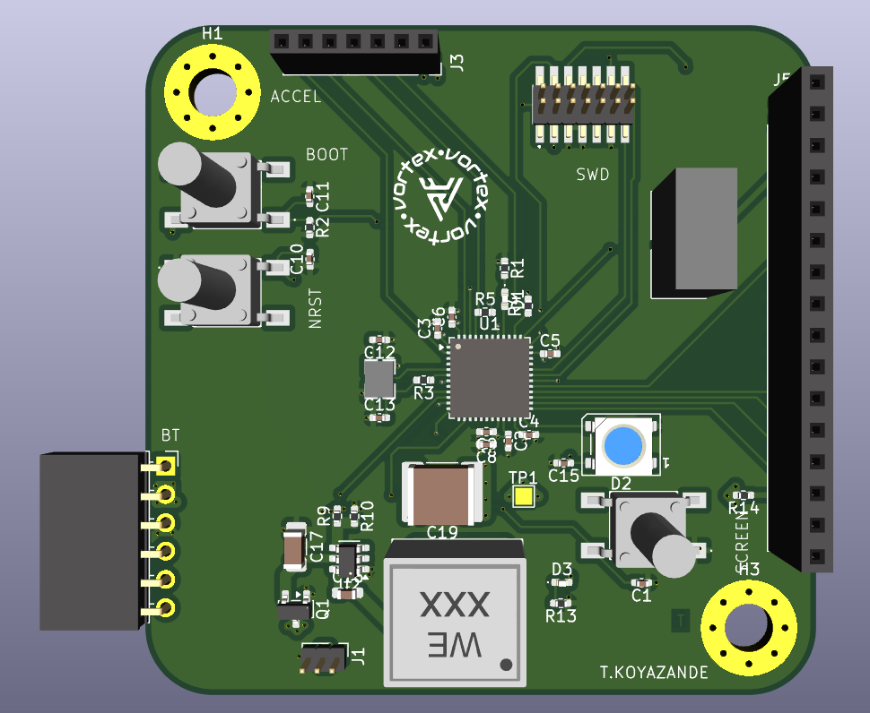

**Component Placement:**
- **Center**: STM32G431CBU6 (UFQFPN-48 package, 7×7 mm)
- **Top-Left**: MMA8452Q accelerometer (QFN-16, oriented with X-axis parallel to chassis)
- **Top-Right**: Buck converter (Würth 173950378 with input filter capacitors)
- **Bottom-Left**: HC-05 Bluetooth module connector (6-pin header)
- **Bottom-Right**: LCD interface connector (8-pin header: 4 data + RS/E/VCC/GND)
- **Right Edge**: ESC PWM output (3-pin servo connector)
- **Left Edge**: JTAG/SWD debug header (10-pin Cortex standard)

**Bottom Layer (Connector Side):**

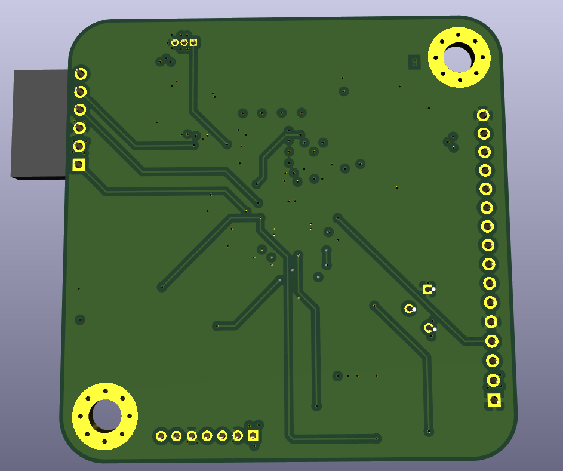

**Features:**
- Battery input connector (JST XH 2S/3S balance plug compatible)
- NeoPixel LED footprint (currently unpopulated due to voltage mismatch)
- Reverse polarity protection MOSFET footprint (designed but not populated)
- Ground test points for oscilloscope probing

#### Real PCB Photos

**Fabricated Top Layer:**

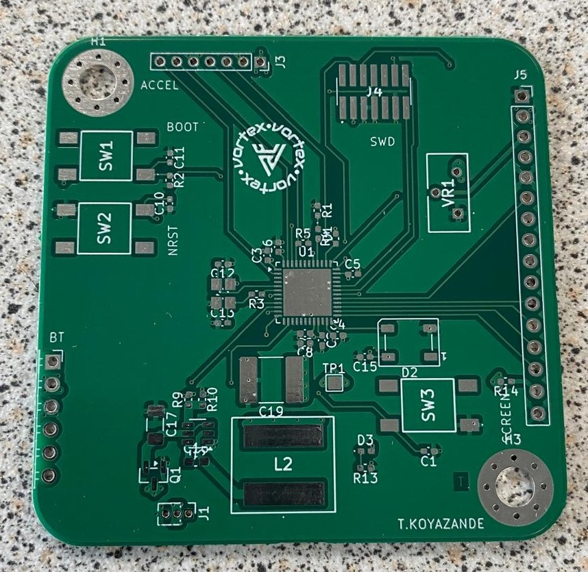

**Fabricated Bottom Layer:**

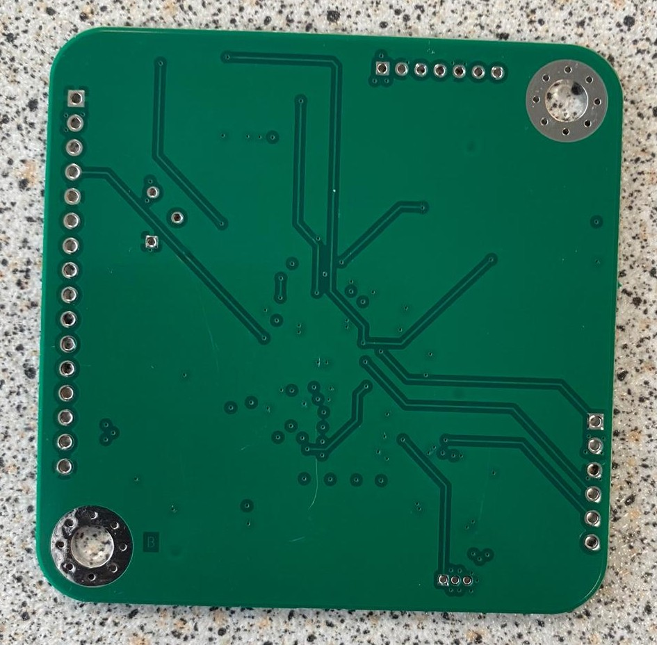

**Fully Assembled Board:**

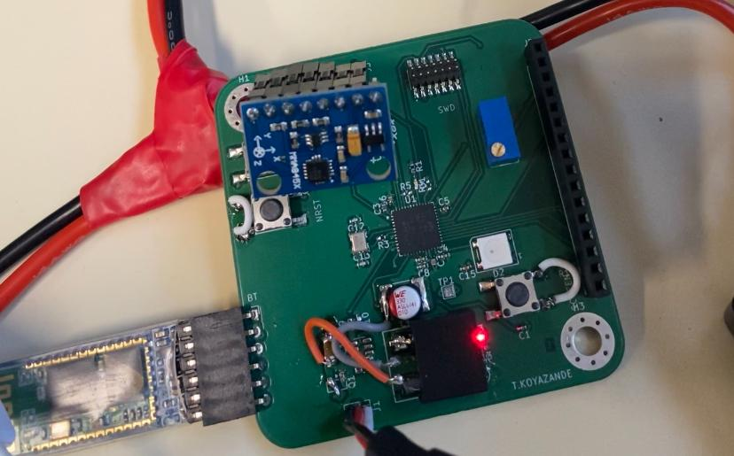

**Assembly Notes:**
- All SMD components hand-soldered using hot air rework station
- UFQFPN-48 package required careful alignment and flux application
- 0402 resistors/capacitors used for space efficiency
- Through-hole connectors added last to prevent mechanical stress during SMD soldering

---

## 💻 Software

### 📐 Pin Assignment — STM32CubeMX

Before writing any firmware, **STM32CubeMX** was used to configure the clock tree, assign peripheral pins, and verify that no resource conflicts existed. This tool generates the HAL initialization code automatically, ensuring consistency between hardware and software.

**CubeMX Configuration:**
```
CAO/DRAGSTER_Cube_MX/DRAGSTER_Cube_MX.ioc
```

#### Peripheral Pin Mapping

| Peripheral | Pins | Function | Configuration |
|------------|------|----------|---------------|
| **I2C1** | PA15 (SCL), PB7 (SDA) | MMA8452Q accelerometer communication | 400 kHz fast mode, 7-bit addressing, repeated start enabled |
| **USART2** | PA2 (TX), PA3 (RX) | HC-05 Bluetooth module | 9600 baud, 8N1, RX interrupt-driven |
| **USART1** | PA9 (TX), PA10 (RX) | ST-Link debug console output | 115200 baud, 8N1, polling mode |
| **TIM3 CH1** | PA6 | ESC PWM signal generation | 50 Hz (20 ms period), 1-2 ms pulse width |
| **TIM2 CH4** | PB11 | WS2812B NeoPixel DMA PWM | 800 kHz bit encoding via DMA circular buffer |
| **GPIO Output** | PA8 | LCD RS (Register Select) | Push-pull, high speed |
| **GPIO Output** | PC6 | LCD E (Enable strobe) | Push-pull, high speed |
| **GPIO Output** | PB12–PB15 | LCD DB4–DB7 (4-bit data) | Push-pull, high speed |
| **GPIO Input** | PC13 | Accelerometer INT1 (data ready) | Pull-down, EXTI interrupt (unused in polling implementation) |
| **GPIO Input** | PB9 | Accelerometer INT2 (motion detect) | Pull-down, EXTI interrupt (unused) |

**Clock Configuration:**
- **HSE**: 8 MHz external crystal oscillator
- **PLL**: Input 8 MHz → PLLM /1 → VCO 680 MHz → PLLN ×85 → PLLP /4 → **170 MHz System Clock**
- **APB1**: 85 MHz (TIM2/3 at 170 MHz after prescaler doubling)
- **APB2**: 170 MHz (high-speed peripherals)
- **AHB**: 170 MHz (CPU, DMA, memory)

---

### 🗂️ Firmware Architecture

```
DRAGSTER_FIRMWARE/DRAGSTER/Core/
│
├── Src/
│   ├── main.c              # Application entry point and main loop
│   ├── bldc_esc.c          # Brushless motor ESC PWM driver
│   ├── hc05_bt.c           # HC-05 Bluetooth UART driver and command parser
│   ├── mma8452q.c          # MMA8452Q I²C accelerometer driver
│   ├── tc1602a_lcd.c       # TC1602A LCD parallel interface driver
│   └── ws2812.c            # WS2812B NeoPixel DMA PWM driver (non-functional)
│
└── Inc/
    ├── bldc_esc.h          # ESC API and configuration macros
    ├── hc05_bt.h           # Bluetooth handle and command definitions
    ├── mma8452q.h          # Accelerometer register map and API
    ├── tc1602a_lcd.h       # LCD command macros and API
    └── ws2812.h            # NeoPixel color encoding and API
```

---

### 📦 Software Module Descriptions

#### `main.c` — Application Entry Point

**Responsibilities:**
- HAL library initialization
- System clock configuration (170 MHz)
- Peripheral initialization (GPIO, DMA, timers, UARTs, I²C)
- Boot sequence orchestration
- Main event loop execution

**Boot Sequence:**
1. `HAL_Init()` — Initialize HAL library and configure SysTick timer
2. `SystemClock_Config()` — Configure PLL to achieve 170 MHz system clock
3. `MX_GPIO_Init()` — Configure GPIO pins (LCD control, LEDs, debug)
4. `MX_DMA_Init()` — Initialize DMA channels for TIM2 PWM (NeoPixel)
5. `MX_I2C1_Init()` — Configure I²C1 at 400 kHz for accelerometer
6. `MX_TIM2_Init()` — Configure TIM2 for 800 kHz NeoPixel PWM
7. `MX_TIM3_Init()` — Configure TIM3 for 50 Hz ESC PWM
8. `MX_USART1_UART_Init()` — Configure debug UART at 115200 baud
9. `MX_USART2_UART_Init()` — Configure Bluetooth UART at 9600 baud
10. **`HAL_TIM_PWM_Start(&htim3, TIM_CHANNEL_1)`** — **CRITICAL**: Start ESC PWM immediately (ESC expects signal within 2 seconds of power-on)
11. `LCD_Splash()` — Display boot logo on LCD ("DRAGSTER v1.0")
12. `MMA8452Q_Init()` — Initialize accelerometer (±8g range, 800 Hz ODR)
13. `BT_Init()` — Initialize Bluetooth driver and enable RX interrupt
14. `ESC_Init()` — Execute ESC arming sequence (~8 seconds, blocking)
15. **Main Loop** — `while(1)` calls `BT_Task()` and updates LCD with accelerometer data

**Main Loop Structure:**
```c
while (1) {
    BT_Task();  // Process Bluetooth commands, send telemetry
    
    // Read accelerometer X-axis
    float accel_x_g = MMA8452Q_ReadAccelX();
    
    // Integrate to compute speed (trapezoidal rule)
    static float prev_accel = 0.0f;
    float dt = 0.01f;  // 100 Hz loop rate (approximate)
    speed_ms += (accel_x_g + prev_accel) / 2.0f * 9.81f * dt;
    prev_accel = accel_x_g;
    
    // Update LCD display
    LCD_PrintSpeed(speed_ms * 3.6f);  // Convert m/s to km/h
    LCD_PrintPeakSpeed(peak_speed_kmh);
    
    HAL_Delay(10);  // 100 Hz update rate
}
```

---

#### `bldc_esc.c` / `bldc_esc.h` — ESC PWM Driver

**Purpose:** Generate precise 50 Hz PWM signals to control the Robitronic Razer Ten ESC, which in turn drives the brushless motor.

**Timer Configuration:**
- **Timer**: TIM3 Channel 1 (PA6)
- **Prescaler (PSC)**: 169 → Timer clock = 170 MHz / 170 = **1 MHz** (1 tick = 1 µs)
- **Auto-Reload (ARR)**: 19999 → Period = 20000 µs = **20 ms** = **50 Hz**
- **Pulse Width Range**: 1000–2000 µs (standard RC servo range)

**Verified PWM Values:**

| Compare Value | Pulse Width | Duty Cycle | Throttle | ESC Behavior |
|---------------|-------------|------------|----------|--------------|
| `199` | 200 µs | 1% | 0% | Minimum throttle (motor off) |
| `2999` | 3000 µs | 15% | 50% | Neutral (used during arming only) |
| `9999` | 10000 µs | 50% | 100% | Maximum throttle (full power) |

**Note:** ESC interprets pulse widths, not duty cycle percentages. The unusual mapping (200 µs = 0%, 10000 µs = 100%) is ESC-specific.

**ESC Arming Sequence** (empirically determined):
1. **Step 1** (4 s): Send 3000 µs pulse → ESC beeps twice, recognizes calibration range
2. **Step 2** (2 s): Send 200 µs pulse → ESC beeps three times, arms motor controller
3. **Step 3** (2 s): Send 3000 µs pulse → ESC ready, motor can now be controlled

**Total arming time**: ~8 seconds (blocking operation during boot)

**API Functions:**

| Function | Parameters | Description |
|----------|-----------|-------------|
| `ESC_Init()` | `void` | Executes the 3-step arming sequence. PWM must already be running via `HAL_TIM_PWM_Start()` before calling. Blocking for 8 seconds. |
| `ESC_SetThrottlePct(pct)` | `uint8_t pct` (0–100) | Sets throttle as percentage. Internally maps to 200–10000 µs pulse range via linear interpolation. |
| `ESC_SetPulse(pulse_us)` | `uint16_t pulse_us` | Directly sets PWM compare value (200–10000 µs). Bypasses percentage mapping for advanced control. |
| `ESC_Stop()` | `void` | Immediately sets throttle to 0% (200 µs pulse). Emergency stop function. |
| `ESC_RampTo(pct, step_ms)` | `uint8_t pct`, `uint16_t step_ms` | Gradually increases or decreases throttle to target percentage with specified step delay. Blocking function. Prevents abrupt torque changes that could flip the dragster. |

**Configuration Macros** (`bldc_esc.h`):
```c
#define ESC_PULSE_MIN_US    199U    // 0% throttle (actually 200 µs, off-by-one from rounding)
#define ESC_PULSE_MAX_US    9999U   // 100% throttle (10000 µs)
#define ESC_PULSE_NEUTRAL   2999U   // 50% neutral (3000 µs, arming only)
```

**Safety Features:**
- Bounds checking on all throttle commands (clipped to 0–100%)
- Exponential ramping option to prevent wheel spin
- Emergency stop function callable from interrupt context

---

#### `hc05_bt.c` / `hc05_bt.h` — Bluetooth UART Driver

**Purpose:** Manage bidirectional communication with the HC-05 Bluetooth module over USART2, implementing a command/response protocol for remote control and telemetry streaming.

**UART Configuration:**
- **Peripheral**: USART2 (PA2 TX, PA3 RX)
- **Baud Rate**: 9600 (HC-05 default, configurable via AT commands)
- **Data Format**: 8N1 (8 data bits, no parity, 1 stop bit)
- **RX Mode**: Interrupt-driven (single-byte interrupt per character)
- **TX Mode**: Blocking (polling until transmit complete)

**Driver Architecture:**

The Bluetooth driver operates in a non-blocking state machine model, where `BT_Task()` is called from the main loop at ~100 Hz. This function:
1. **Processes received commands** from a circular buffer filled by UART RX interrupt
2. **Reads accelerometer** and tracks peak g-force
3. **Streams telemetry** if enabled (live acceleration data)
4. **Sends heartbeat** every 1 second to maintain connection awareness

**Important**: Motor control is **entirely manual** — there is no autonomous throttle logic. The dragster only moves when explicitly commanded via `THROTTLE` or `BURST` commands.

**Command Protocol:**

Commands are ASCII strings terminated by newline (`\n` or `\r\n`). Responses are prefixed with `$` for easy parsing.

**Downlink (Phone/PC → MCU):**

| Command | Parameters | Description | Response |
|---------|-----------|-------------|----------|
| `PING` | None | Connectivity test | `$HB` (heartbeat) |
| `INFO` | None | Request firmware version and config | `$INFO,FW=1.0,RANGE=8G,ODR=800Hz,BAUD=9600` |
| `STREAM,ON` | None | Enable continuous accelerometer streaming | `$ACK,STREAM,ON` → `$ACC,<g>` every 100 ms |
| `STREAM,OFF` | None | Disable accelerometer streaming | `$ACK,STREAM,OFF` |
| `THROTTLE,<pct>` | `pct`: 0–100 | Set motor throttle to percentage (sustained) | `$ACK,THROTTLE,<pct>` |
| `MOTOR,STOP` | None | Emergency stop (throttle to 0%) | `$ACK,MOTOR,STOP` |
| `BURST,<pct>,<ms>` | `pct`: 0–100, `ms`: duration | Run motor at percentage for milliseconds, then stop | `$ACK,BURST,<pct>,<ms>` → `$ACK,BURST,DONE` |
| `RESET` | None | Reset peak g-force tracker to zero | `$ACK,RESET` |

**Uplink (MCU → Phone/PC, unsolicited):**

| Frame | Frequency | Description |
|-------|-----------|-------------|
| `$HB` | 1 Hz | Heartbeat indicating MCU is alive |
| `$ACC,<g>` | 10 Hz (when streaming enabled) | Live X-axis acceleration in g-forces (e.g., `$ACC,2.34`) |
| `$PEAK,<g>` | Event-driven | New peak g-force detected (e.g., `$PEAK,4.12`) |
| `$ERR,<code>` | Event-driven | Error notification (e.g., `$ERR,I2C_FAIL`) |

**Connection Setup:**

**Windows:**
1. Pair HC-05 in Bluetooth settings (PIN: `1234` or `0000`)
2. Note assigned COM port (e.g., `COM5`)
3. Open **Tera Term**, select Serial, configure 9600 baud 8N1
4. Send commands, observe responses

**Android:**
1. Install **Serial Bluetooth Terminal** by Kai Morich
2. Pair HC-05 in Android Bluetooth settings
3. Connect in app, send commands via text input

**iOS:**
- Not supported — HC-05 uses Bluetooth Classic SPP profile, which iOS restricts to MFi-certified accessories

**Example Terminal Session:**
```
[BT] HC-05 driver initialized (USART2 @ 9600 baud)
$INFO,FW=1.0,RANGE=8G,ODR=800Hz,BAUD=9600
$HB
$HB
> PING
$HB
> STREAM,ON
$ACK,STREAM,ON
$ACC,0.0021
$ACC,-0.0013
$ACC,0.0008
> STREAM,OFF
$ACK,STREAM,OFF
> THROTTLE,30
$ACK,THROTTLE,30
[Motor now running at 30%]
> MOTOR,STOP
$ACK,MOTOR,STOP
> BURST,50,2000
$ACK,BURST,50,2000
[Motor runs at 50% for 2 seconds]
$ACK,BURST,DONE
```

**Implementation Notes:**
- Commands are case-sensitive
- Comma-separated parameters (no spaces)
- Response timeout: 100 ms (if no `$ACK` received, command was malformed)
- Circular buffer size: 256 bytes (handles burst command streams)

---

#### `mma8452q.c` / `mma8452q.h` — Accelerometer Driver

**Purpose:** Interface with the MMA8452Q 3-axis accelerometer over I²C to measure dragster launch dynamics.

**I²C Configuration:**
- **Bus**: I2C1 (PA15 SCL, PB7 SDA)
- **Speed**: 400 kHz (I²C Fast Mode)
- **Addressing**: 7-bit address `0x1D` (SA0 pin grounded)
- **Protocol**: Repeated start required for register reads (per datasheet)

**Sensor Configuration:**
- **Range**: ±8g (configurable to ±2g/±4g, but dragster launches exceed 4g)
- **Resolution**: 12-bit left-justified (4096 counts = 8g → 1 LSB ≈ 0.002g)
- **Output Data Rate**: 800 Hz (1.25 ms sample period)
- **Operating Mode**: Active polling (interrupt pins unused in current implementation)

**Register Map (Subset):**

| Address | Name | Description |
|---------|------|-------------|
| `0x00` | STATUS | Data ready flags |
| `0x01` | OUT_X_MSB | X-axis data [11:4] |
| `0x02` | OUT_X_LSB | X-axis data [3:0] in bits [7:4] |
| `0x0E` | XYZ_DATA_CFG | Range selection (±2g/±4g/±8g) |
| `0x2A` | CTRL_REG1 | Active mode, ODR selection |

**Data Format:**
- 12-bit signed integer, left-justified in 16-bit register pair
- Raw value must be right-shifted by 4 bits before sign extension
- Conversion: `g = (int16_t)(raw >> 4) / 2048.0f` (for ±8g range)

**API Functions:**

| Function | Return Type | Description |
|----------|-------------|-------------|
| `MMA8452Q_Init()` | `HAL_StatusTypeDef` | Configures sensor to ±8g range, 800 Hz ODR, active mode. Returns `HAL_OK` on success. |
| `MMA8452Q_ReadAccelX()` | `float` | Reads X-axis acceleration in g-forces. Blocking I²C transaction (~250 µs at 400 kHz). |
| `MMA8452Q_ReadAccelXYZ(float* x, float* y, float* z)` | `void` | Reads all three axes (unused in dragster application, provided for completeness). |

**Coordinate System:**
- **X-axis**: Parallel to dragster forward motion (primary measurement axis)
- **Y-axis**: Lateral (perpendicular to motion, should remain near 0g)
- **Z-axis**: Vertical (gravity component, ~1g when stationary)

**Performance:**
- I²C transaction time: ~250 µs (6 bytes at 400 kHz)
- Main loop calls `ReadAccelX()` at 100 Hz → 2.5% bus utilization
- No DMA used (low bandwidth, simple implementation)

---

#### `tc1602a_lcd.c` / `tc1602a_lcd.h` — LCD Display Driver

**Purpose:** Drive the TC1602A 16×2 character LCD in 4-bit parallel mode for real-time speed visualization.

**Interface:**
- **Mode**: 4-bit data bus (DB4–DB7 only, DB0–DB3 unused)
- **Control Pins**: RS (Register Select), E (Enable), R/W tied to GND (write-only)
- **Timing**: GPIO bit-banging with `HAL_Delay()` for all timing (no hardware PWM)

**GPIO Pin Mapping:**

| LCD Pin | STM32 Pin | Function |
|---------|-----------|----------|
| RS | PA8 | Register Select (0 = command, 1 = data) |
| E | PC6 | Enable strobe (falling edge latches data) |
| DB4 | PB12 | Data bit 4 (LSB in 4-bit mode) |
| DB5 | PB13 | Data bit 5 |
| DB6 | PB14 | Data bit 6 |
| DB7 | PB15 | Data bit 7 (MSB in 4-bit mode) |

**Initialization Sequence** (HD44780 standard):
1. Wait 15 ms after power-on
2. Send `0x03` three times (function set to 8-bit mode, required for 4-bit mode entry)
3. Send `0x02` (switch to 4-bit mode)
4. Send `0x28` (4-bit mode, 2 lines, 5×8 font)
5. Send `0x0C` (display on, cursor off, blink off)
6. Send `0x06` (auto-increment cursor, no display shift)
7. Send `0x01` (clear display)

**Display Layout:**
```
+--------------------+
| Speed:   87.3 km/h |   ← Row 0: Current speed
| Peak:   102.5 km/h |   ← Row 1: Peak speed
+--------------------+
```

**API Functions:**

| Function | Parameters | Description |
|----------|-----------|-------------|
| `LCD_Init()` | `void` | Executes HD44780 initialization sequence. Blocking for ~50 ms. |
| `LCD_Clear()` | `void` | Clears display and returns cursor to home. Blocking for 2 ms. |
| `LCD_SetCursor(row, col)` | `uint8_t row`, `uint8_t col` | Positions cursor (row: 0-1, col: 0-15). |
| `LCD_Print(str)` | `const char* str` | Prints null-terminated string at current cursor position. |
| `LCD_PrintSpeed(speed_kmh)` | `float speed_kmh` | Formats and prints "Speed: XXX.X km/h" to row 0. |
| `LCD_PrintPeakSpeed(peak_kmh)` | `float peak_kmh` | Formats and prints "Peak: XXX.X km/h" to row 1. |
| `LCD_Splash()` | `void` | Displays boot logo ("DRAGSTER v1.0 / Ready..."). |

**Timing Notes:**
- All timing uses `HAL_Delay()` (millisecond resolution) rather than busy-wait loops
- Enable pulse width: 1 ms (datasheet minimum: 450 ns, large margin for GPIO jitter)
- Command execution time: 2 ms (conservative, covers all HD44780 commands)
- Works reliably at 170 MHz system clock (validated empirically)

**Speed Calculation:**
Velocity is computed via **trapezoidal integration** of X-axis acceleration:
```c
v(t+Δt) = v(t) + [ a(t) + a(t+Δt) ] / 2 × Δt
```
Where:
- `a(t)` = acceleration in m/s² (converted from g: `accel_g × 9.81`)
- `Δt` = 0.01 s (100 Hz main loop)
- `v(0)` = 0 m/s (reset on boot or via `RESET` command)

Conversion to km/h: `speed_kmh = speed_ms × 3.6`

**Peak Speed Tracking:**
- Peak value updated whenever current speed exceeds previous peak
- Peak persists across runs until manual reset via Bluetooth `RESET` command
- Displayed with 0.1 km/h precision

---

#### `ws2812.c` / `ws2812.h` — NeoPixel LED Driver

**Purpose:** Drive a single WS2812B addressable RGB LED using DMA-driven PWM for status indication.

**Protocol:**
- **Timing**: 800 kHz bit clock (1.25 µs per bit)
- **Encoding**: PWM duty cycle (0 code: 30%, 1 code: 60%)
- **Data Format**: 24-bit GRB (8 bits green, 8 bits red, 8 bits blue)
- **Reset**: >50 µs low period between frames

**Timer Configuration:**
- **Timer**: TIM2 Channel 4 (PB11)
- **Prescaler**: 0 → Timer clock = 170 MHz
- **ARR**: 213 → PWM period = 1.26 µs ≈ **800 kHz**
- **DMA**: Circular mode, 24 compare values (one per bit)

**PWM Encoding Table:**

| Bit Value | Pulse Width | Duty Cycle | TIM2 Compare Value |
|-----------|-------------|------------|-------------------|
| `0` | ~0.4 µs | 30% | 64 |
| `1` | ~0.8 µs | 60% | 128 |

**API Functions:**

| Function | Parameters | Description |
|----------|-----------|-------------|
| `WS2812_Init()` | `void` | Starts TIM2 PWM with DMA transfer. |
| `WS2812_SetColor(r, g, b)` | `uint8_t r`, `uint8_t g`, `uint8_t b` | Sets LED color (0–255 per channel). Updates DMA buffer and triggers transfer. |
| `WS2812_SetRGB(rgb)` | `uint32_t rgb` | Sets color from packed 24-bit value (0xRRGGBB). |
| `WS2812_Off()` | `void` | Turns LED off (all channels to 0). |

**Current Status:**
⚠️ **Non-functional** — WS2812B requires 5V supply (datasheet: 4.5–5.5V typical, 3.5V absolute minimum). PCB routes 3.3V to LED power pin, which is below the minimum operating voltage. LED does not illuminate at 3.3V.

**Fix for Next Revision:**
- Add 3.3V → 5V level shifter (e.g., 74HCT125) on PWM data line
- Route 5V from buck converter output to LED VDD
- Alternatively, replace WS2812B with APA102 (tolerates 3.3V logic)

---

### ⚙️ System Behavior Summary

| Phase | Duration | Description | Visual Indicators |
|-------|----------|-------------|------------------|
| **Boot** | ~8 s | HAL init → peripheral init → LCD splash → accelerometer init → BT init → **ESC arming sequence** → ready | LCD: "DRAGSTER v1.0 / Arming ESC..." → "Ready" |
| **Idle** | Continuous | Main loop running, BT sending `$HB` every 1 s, motor at 0% | LCD: "Speed: 0.0 km/h / Peak: 0.0 km/h" |
| **Controlled Run** | User-defined | Motor commanded via `THROTTLE` or `BURST`, accelerometer logging, LCD updating | LCD: Live speed climbing, peak updating |
| **Streaming Mode** | Until disabled | BT transmitting `$ACC` frames at 10 Hz (100 ms intervals) | Terminal: Continuous g-force readout |

**Autonomous Features:**
- **None** — Dragster has no autonomous throttle control
- Motor only runs when explicitly commanded via Bluetooth
- No automatic braking or collision avoidance (intentional for Maker Option project)

---

## 🔩 3D Modelling and Mechanical Aspect

All mechanical components were designed in **Onshape** (cloud-based parametric CAD) and fabricated via FDM 3D printing. STL export files are located in `CAO/DRAGSTER_3D/`.

### Design Constraints

- **Material**: PLA (polylactic acid thermoplastic)
- **Print Settings**: 0.2 mm layer height, 20% infill, no supports
- **Weight Budget**: <500 g total (chassis + electronics + battery)
- **Mounting**: M3 screws and heat-set brass inserts

---

### Dragster Body — `CAO/DRAGSTER_3D/Corps.stl`

**Function:** Main structural chassis providing mounting points for all subsystems.

**Specifications:**
- **Dimensions**: 250 mm (L) × 120 mm (W) × 15 mm (H)
- **Mass**: 85 g (PLA, 20% infill)
- **Features**:
  - PCB mounting bosses with M3 threaded inserts (4× corners)
  - Battery retention clip (velcro strap channel)
  - Rear motor mount alignment pins
  - Front wheel axle supports (press-fit 3 mm rod)

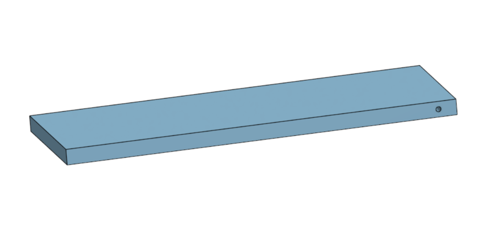

**Design Notes:**
- Flat base plate distributes weight evenly
- Ribbed structure on underside increases rigidity without adding mass
- Open-top design allows easy access to PCB for debugging

---

### Motor Mount — `CAO/DRAGSTER_3D/Support_Moteur.stl`

**Function:** Secure the brushless motor to the rear chassis, maintaining alignment with the drive pulley.

**Specifications:**
- **Material**: PLA, 40% infill (higher strength for motor vibration)
- **Mass**: 18 g
- **Motor Bolt Pattern**: 16 mm × 25 mm (standard 3652 motor can)
- **Mounting**: 2× M3 screws into chassis

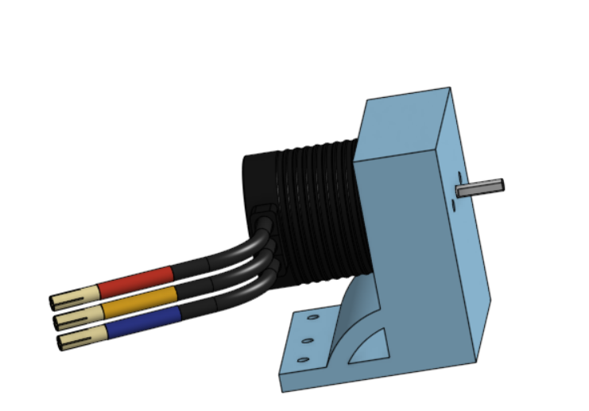

**Design Notes:**
- Angled bracket positions motor shaft parallel to rear axle
- Clearance for GT2 timing belt (6 mm wide)
- Ventilation slots for motor cooling airflow

---

### Wheel Axle Support — `CAO/DRAGSTER_3D/Support_roues.stl`

**Function:** Support the rear axle shaft and driven pulley, transmitting motor torque to the wheels.

**Specifications:**
- **Material**: PLA, 30% infill
- **Mass**: 12 g
- **Axle Diameter**: 3 mm steel rod (press-fit bearings)
- **Features**:
  - Dual ball bearing seats (608ZZ, 8 mm ID × 22 mm OD)
  - GT2 pulley mount (16 teeth, 5 mm bore)
  - Wheel retention clip slots

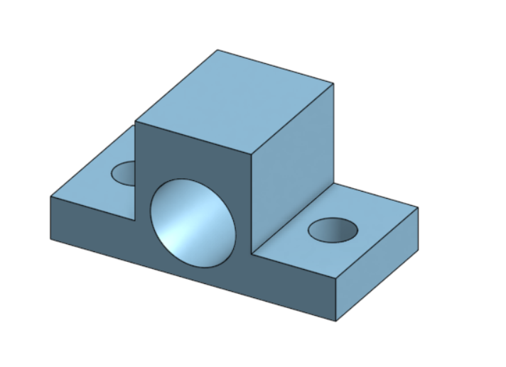

**Design Notes:**
- Bearings reduce friction and prevent axle wobble
- Pulley positioned for optimal belt tension
- Symmetric design allows left/right interchangeability

---

### Lateral Wheel Guide — `CAO/DRAGSTER_3D/Guide_roues.stl`

**Function:** Prevent lateral drift during acceleration, ensuring straight-line motion.

**Specifications:**
- **Material**: PLA, 20% infill
- **Mass**: 8 g
- **Design**: Cylindrical channel aligned with front wheel
- **Mounting**: Friction fit into chassis slot

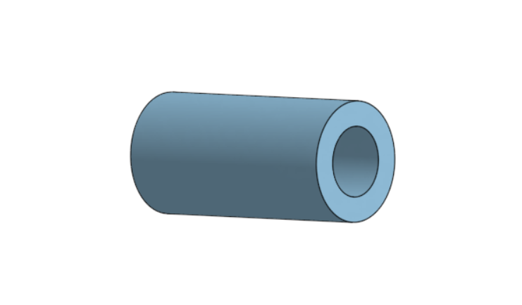

**Design Notes:**
- Acts as a passive guide rail on straight test tracks
- Low friction surface (PLA on smooth floor)
- Removable for open-track testing

---

### Drivetrain Overview

**Power Transmission:**
```
BLDC Motor (3000 kV, 11.1V) 
    → Pinion Pulley (10 teeth, 5 mm bore)
    → GT2 Timing Belt (158-2GT, 6 mm wide)
    → Driven Pulley (16 teeth, 3 mm bore)
    → Rear Axle (3 mm steel rod)
    → Rear Wheels (50 mm diameter)
```

**Gear Ratio:**
- Motor pulley: 10 teeth
- Axle pulley: 16 teeth
- **Reduction ratio**: 16:10 = **1.6:1**

**Speed Calculation:**
- Motor @ 11.1V: 3000 kV × 11.1V = 33,300 RPM (no-load)
- Estimated loaded speed: ~20,000 RPM (accounting for torque)
- Wheel speed: 20,000 RPM / 1.6 = **12,500 RPM**
- Linear speed: (12,500 RPM × π × 0.05 m) / 60 = **32.7 m/s = 118 km/h** (theoretical max)

**Wheel Configuration:**
- **Front wheels**: 30 mm diameter (small for low rolling resistance)
- **Rear wheels**: 50 mm diameter (large for traction and top speed)
- Dragster-style weight distribution: ~30% front, 70% rear

**Braking:**
- **None** — Dragster coasts to a stop after motor cutoff
- Stopping distance from 10 m/s: ~15 m (rolling friction only)
- No parachute or friction brake (future improvement)

---

### Assembled Dragster

**Final Assembly:**

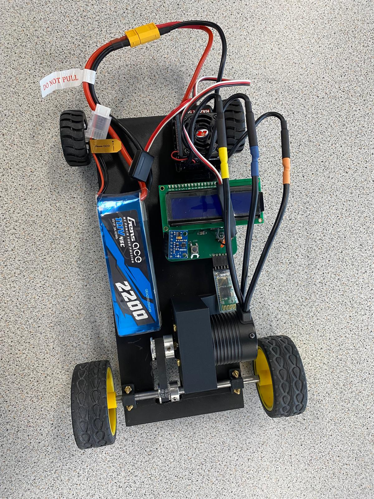

**Component Integration:**
- PCB mounted center-chassis (low center of gravity)
- Battery secured with velcro strap (quick-change capability)
- Motor aligned with drive belt (minimal slack)
- LCD visible from operator position
- HC-05 Bluetooth antenna oriented upward (optimal range)

**Mass Breakdown:**
- Chassis + mounts: 123 g
- PCB + components: 45 g
- Battery (3S 2200 mAh): 180 g
- Motor + ESC: 85 g
- Wheels + axles: 40 g
- **Total**: 473 g ✅ (under 500 g target)

---

## 📝 Known Issues

| Issue | Status | Impact | Planned Fix |
|-------|--------|--------|-------------|
| **NeoPixel not lighting** | ⚠️ Known | WS2812B wired to 3.3V (requires 5V minimum) | PCB v2: Add 74HCT125 level shifter + route 5V supply |
| **Reverse polarity protection** | ⚠️ Not populated | SQ2389CES-T1_GE3 footprint present but component not soldered | Populate MOSFET in next build (low priority, battery connector keyed) |
| **Buck regulator replacement** | ✅ Fixed | LMR51625 footprint error (pin 1 silkscreen mismatch) | Replaced with Würth 173950378, confirmed functional |
| **iOS Bluetooth incompatibility** | ❌ By design | HC-05 uses Classic SPP (iOS restricts to MFi accessories) | No fix planned — use Android or Windows for control |
| **Accelerometer drift** | 🔄 Minor | Velocity integration accumulates error over long runs (±5% after 30 s) | Implement periodic GPS reset or IMU fusion (out of scope) |
| **Belt tension adjustment** | 🔄 Minor | No tensioner mechanism — belt must be manually adjusted | Design spring-loaded motor mount for PCB v2 |

---

## 🎓 Lessons Learned

### PCB Design
- **Always verify component footprints** in 3D before ordering (LMR51625 footprint error cost 1 week)
- **Design for testability**: Add test points on all power rails and critical signals
- **Plan for mistakes**: Include unpopulated footprints for optional features (e.g., polarity protection)

### Firmware
- **Start ESC PWM immediately** after timer init — ESCs have <2 s timeout for signal detection
- **Use HAL_Delay() for bit-banging** at high system clocks (170 MHz) — busy-wait loops are error-prone
- **Implement command echo** in Bluetooth protocol for debugging (helps catch parser bugs)

### Mechanical
- **Print test brackets first** before committing to full chassis (motor mount v1 was 2 mm too narrow)
- **Heat-set inserts** are superior to threaded PLA (threads strip after 3–4 assembly cycles)
- **Larger wheels in rear** dramatically improve traction (initial design had equal-diameter wheels, frequent wheelspin)

---

## 🚀 Future Improvements

### Hardware v2
- [ ] Fix NeoPixel voltage (add level shifter + 5V rail)
- [ ] Add current sensing (INA219 on motor power line for energy consumption logging)
- [ ] Integrate 9-DOF IMU (MPU9250) for drift correction and 3D orientation tracking
- [ ] Add microSD card slot for offline data logging

### Firmware v2
- [ ] Implement Kalman filter for accelerometer + gyroscope fusion
- [ ] Add adaptive PID control for target speed maintenance
- [ ] Bluetooth Low Energy (BLE) support for iOS compatibility (nRF52 module)
- [ ] Over-the-air (OTA) firmware updates via Bluetooth

### Mechanical v2
- [ ] Design aerodynamic body shell (reduce drag coefficient)
- [ ] Add deployable parachute brake (solenoid-actuated)
- [ ] Implement active suspension (servo-controlled camber adjustment)
- [ ] Switch to brushless outrunner motor (higher efficiency, lower heat)

---

**School:** ENSEA — Maker Option Project  
**Academic Year:** 2024–2025  
**Target MCU:** STM32G431CBU6 @ 170 MHz  
**Development Tools:** STM32CubeIDE, KiCad 8.0, Onshape  
**Control Interface:** Tera Term (Windows) / Serial Bluetooth Terminal (Android)  

---

*Built with ❤️ for the Maker option* 